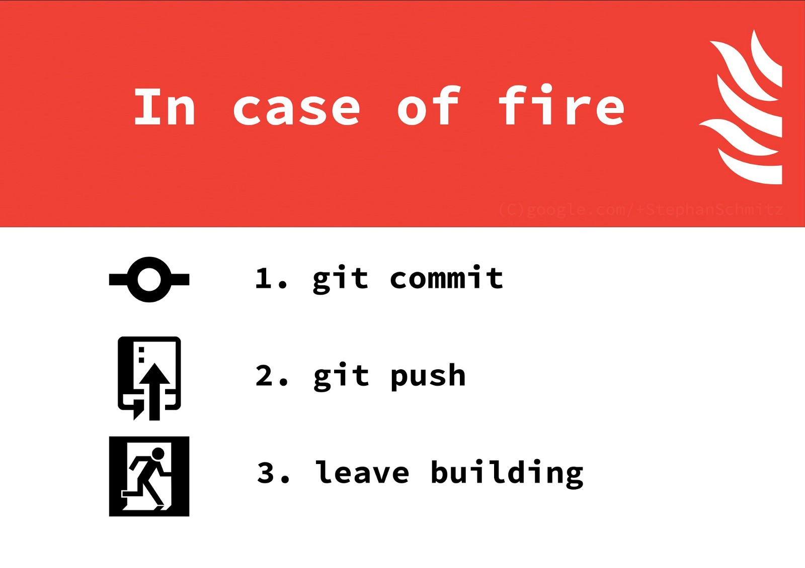
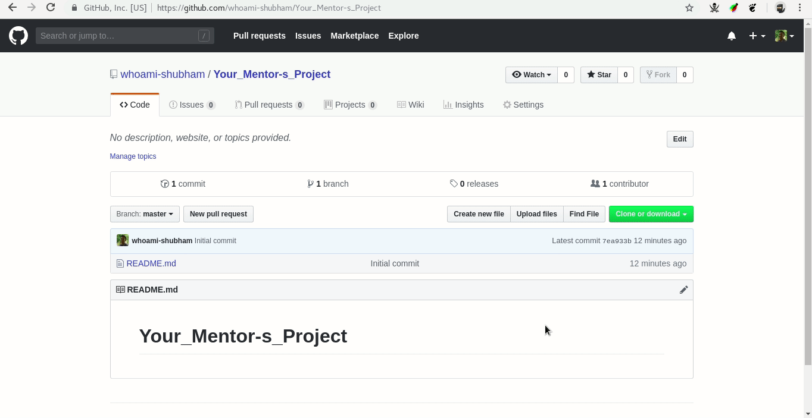

# Student Guide

### Why Should You Apply?
While you’ll be adding your piece of code to the existing codebase,
you will get to learn the structure of the project and more about the
process of creating it from scratch.
That, in future will help you in creating your own projects.

### requirements
 - A Working Laptop / PC With Internet Connection
 - A github account if you dont have sign up [now](https://github.com/join)

### Leaderboard
The leaderboard which displays all the activities by registered students
would be live at the [website](https://whoami-shubham.github.io/Summer_of_Code/#/leaderboard). Basically it represents the activity
of each and every student registered.

### Choosing A Project
First of all, you can choose as many projects as you want. It’s not about
doing everything on just one project, but solving as many issues as you
can, contributing as much as you can.

### Adding Your Own Project
Summer of Code is about working on Open Source . In case you did not
like any of the projects listed. Tell us about
the project you’re working on, add your project as mentor.

### steps
  * fork your mentor's project -> clone repository -> code -> push  -> send pull request
### steps for clone and push
  
  

### Coding Style
Almost all the languages have a definitive style guide for them. Putting
correct indentation, obeying line lengths, etc. are the features which make
the code more and more readable.You should work with your mentor about the code styling.

### Writing Documentation
The code that you have added must be documented thoroughly. Open
Source is about writing code that humans can read and understand.
Without documentation, it is so hard to read any code. Hence, add
information in README, in the comments of code etc. Ask the mentor to
help you out with it.

### resources
 - Overview of first contribution. follow given steps for your [first contribution](https://github.com/firstcontributions/first-contributions)
 - A Medium [Article](https://codeburst.io/a-step-by-step-guide-to-making-your-first-github-contribution-5302260a2940)
 - A Youtube [video](https://youtu.be/MJUJ4wbFm_A). Don’t be afraid if you don’t have a Linux / Mac you can use git commands in windows
   using [git bash](https://git-scm.com/download/win)

### Contact
The contact details of each mentor will be available to you on the projects
list. So, you have every right to contact the mentor and ask for
help on the project.At the same time, we do hope that the participants be polite while making
contact. One should realise that after all, the mentors are students
themselves, and they might not always be available at the moment’s notice.
Ideally one should wait for at least a day for the mentor’s reply.

